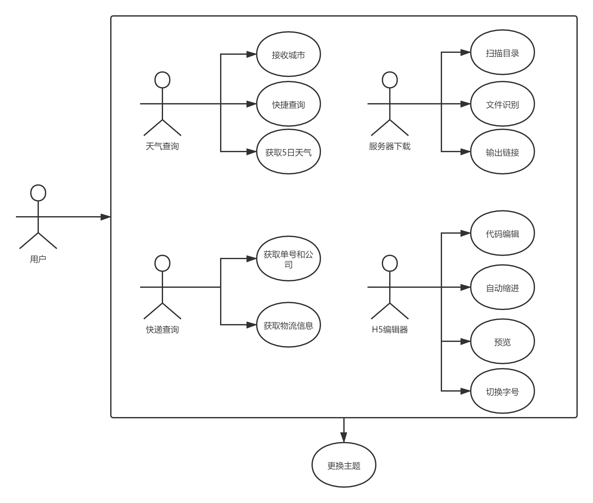

# 需求分析

## 简介

本文档用于描述由吉大软件2018级H5课程设计项目：网页小工具集。

本项目目前包括四个部分，由四位成员分别制作，用于完成一些便民功能，并提供互相跳转的链接，方便用户使用。

## 用户分析

使用本项目的用户一般不需要经常性用到某些特定功能，但是偶尔会需要急用一些功能比如快递查询天气查询。如果为此刻意下载软件或者搜索相关网站非常麻烦，也可
能带来不必要的麻烦。所以很多用户希望出现一个网页，收集了不少需要用到的功能，每当有快递需要查询或者想知道第二天的天气的时候，就可以打开网页非常快地找
到所需功能。

## 项目目的与目标

### 目的

方便用户使用到一些平时不经常使用到的功能，从而无需在手机上保存一个巨大的软件。

### 目标

组员一共四人每人完成一个自选功能，并且能够完全满足用户在此方面的需求，不止是普通的功能，也包含一些技术人员能够使用的功能。

## 功能表

组员|开发项目|
|:---:|:---:|
|钟健|HTML实时演示|
|张博清|天气查询|
|赵天齐|服务器下载页面|
|施运理|快递查询|

### 用例图

## 界面和接口

### 界面

网页干净整洁，没有除了主体功能以外的元素，全局采用Material Design，局部自由设计。使用应当简易，没有学习成本。

### 接口

服务器下载页面需要运行在服务器且需要PHP环境；快递查询需要.NET平台支持；其余皆为前端实现。
